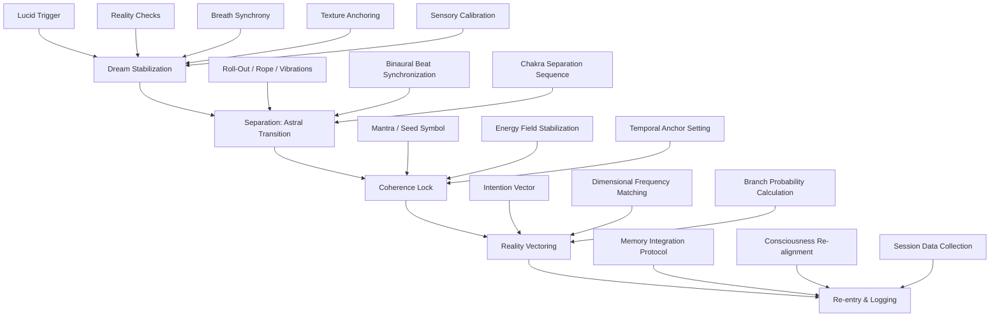
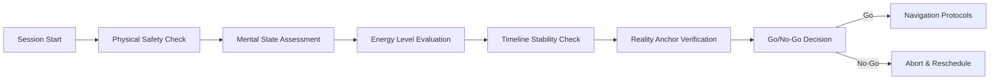
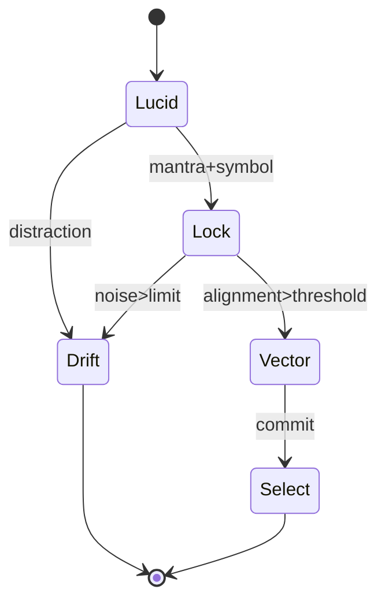
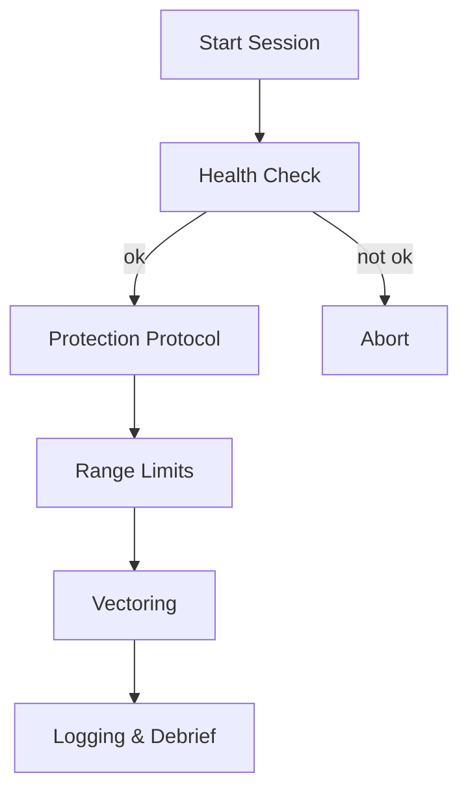

# Atlas of Lucid Navigation: A Practical Guide to Reality Selection

## Overview

This handbook presents a comprehensive framework for navigating alternate realities through structured consciousness manipulation. The methodology integrates established lucid dreaming techniques with advanced astral projection protocols and theoretical interdimensional navigation systems. This is a systematic approach to reality selection through graduated consciousness states.

### Theoretical Foundation

The Atlas methodology is based on the **Coherent Reality Interface Theory (CRIT)**, which posits that consciousness exists at multiple dimensional frequencies simultaneously. Through specific techniques, practitioners can shift their primary consciousness anchor from one reality branch to another while maintaining coherence and recall.

### Training Prerequisites

- **Minimum 6 months** consistent meditation practice (20+ minutes daily)
- **Sleep cycle stability** (±30 minutes variance)
- **Dream recall rate** above 70% for 4 consecutive weeks
- **Basic binaural beat familiarity** (theta/alpha range)
- **Completed safety protocols** certificationas of Lucid Navigation: A Practical Guide to Reality Selection

## Overview

This handbook presents a complete framework for selecting alternate realities through a staged practice: lucid dreaming → astral travel → intentional reality selection. Focusing on interdimensional travel, multiverse ethics, and repeatable “navigation protocols.”

### Core Navigation Pipeline



### Enhanced Safety Matrix



## Key Concepts

### Terminology
- **Lucid Trigger**: Consciousness state transition mechanism using physical or mental cues to achieve dream awareness
- **Coherence Lock**: Multi-layered stabilization protocol maintaining perceptual integrity across dimensional frequencies
- **Reality Vector**: 4-dimensional parameter array encoding spatial coordinates, temporal displacement, consciousness bias, and entropy tolerance
- **Astral Tethering**: Safety mechanism maintaining connection to origin timeline during navigation
- **Dimensional Frequency**: Vibrational signature unique to each reality branch, measurable in coherence units

### Expanded Terminology
- **Consciousness Bandwidth**: Range of dimensional frequencies accessible to individual practitioners
- **Reality Anchor**: Persistent mental construct maintaining orientation to home timeline
- **Navigation Window**: Optimal time period for dimensional transition based on individual biorhythms
- **Probability Cascade**: Sequential branch evaluation process for reality selection
- **Quantum Entanglement Bridge**: Temporary connection mechanism between consciousness states

### Ethical Framework and Operational Guidelines

#### Core Principles
1. **Prime Directive**: No interference with inhabited timelines without explicit consent from dominant consciousness
2. **Conservation Law**: Energy extraction from visited realities must be balanced with equivalent contribution
3. **Temporal Integrity**: Maintain causal consistency to prevent paradox propagation
4. **Consciousness Sovereignty**: Respect the autonomous development of all sentient beings

#### Operational Ethics
- **Pre-Navigation Consent Protocol**: Establish communication with target reality's dominant consciousness field
- **Resource Management**: Document all energy exchanges; maintain neutral or positive balance
- **Information Quarantine**: Restrict knowledge transfer that could disrupt natural timeline development
- **Emergency Protocols**: Immediate withdrawal procedures for encountering hostile or unstable realities

#### Practitioner Responsibilities
- Maintain detailed session logs for peer review and safety monitoring
- Report anomalous encounters to the Navigation Council within 24 hours
- Participate in quarterly calibration sessions to maintain certification
- Mentor novice practitioners under supervised conditions only

## Mathematical Frameworks and Computational Models

### 1) Enhanced Coherence Metric
We evaluate session stability using a multi-factor coherence score $C \in [0,1]$:
$$
C = \sigma\Big(\alpha M + \beta S + \gamma R + \delta T - \epsilon N - \zeta D\Big),\quad \sigma(x)=\frac{1}{1+e^{-x}}
$$
Where:
- $M$: mindfulness index (attention stability)
- $S$: sensory fidelity (perceptual clarity)
- $R$: recall confidence (memory integration)
- $T$: temporal stability (time perception consistency)
- $N$: noise level (interference factors)
- $D$: drift coefficient (uncontrolled state changes)

Coefficients: $\alpha=0.25, \beta=0.20, \gamma=0.15, \delta=0.15, \epsilon=0.15, \zeta=0.10$

### 2) Intention Vector Composition and Normalization
The intention vector $\vec{v}=[p, t, h, e, f]$ includes five dimensions:
- $p$: spatial coordinates (3D vector)
- $t$: temporal offset (scalar, days)
- $h$: health/energy bias (scalar, [-1,1])
- $e$: entropy tolerance (scalar, [0,1])
- $f$: frequency preference (scalar, Hz)

Normalization with adaptive scaling:
$$\tilde{\vec{v}} = \frac{\vec{v} - \mu_{\text{baseline}}}{\|\vec{v} - \mu_{\text{baseline}}\|_2 + \varepsilon}$$

where $\mu_{\text{baseline}}$ is the practitioner's established neutral vector and $\varepsilon=10^{-6}$.

### 3) Branch Selection Probability with Confidence Intervals
Given candidate branches $B_i$ with alignment scores $A_i$, coherence $C$, and uncertainty $U_i$:
$$P(B_i) = \frac{e^{\lambda C A_i - \gamma U_i}}{\sum_j e^{\lambda C A_j - \gamma U_j}}$$

where $\lambda$ controls decisiveness and $\gamma$ penalizes uncertain branches.

Confidence interval for branch selection:
$$CI_{95\%} = P(B_i) \pm 1.96\sqrt{\frac{P(B_i)(1-P(B_i))}{n_{\text{samples}}}}$$

### 4) Temporal Displacement Stability Function
For safe temporal navigation, displacement stability follows:
$$S(t) = e^{-\frac{|t|^{1.5}}{\tau_{\text{max}}}} \cdot \cos\left(\frac{2\pi t}{T_{\text{cycle}}}\right)$$

where $\tau_{\text{max}}$ is maximum safe displacement and $T_{\text{cycle}}$ represents temporal resonance cycles.

### 5) Energy Conservation Model
During reality transitions, energy balance must satisfy:
$$E_{\text{total}} = E_{\text{kinetic}} + E_{\text{potential}} + E_{\text{consciousness}} = \text{constant}$$

With consciousness energy quantified as:
$$E_{\text{consciousness}} = \int_0^T C(t) \cdot I(t) \, dt$$
where $I(t)$ is intention intensity over session duration $T$.

## Comprehensive Training Protocols

### Stage 1: Foundation - Lucid Dreaming Mastery (Weeks 1-8)

#### Week 1-2: Reality Check Development
- **Digital Clock Method**: Check digital displays 10+ times daily; note inconsistencies in dream state
- **Hand Examination**: Count fingers methodically; dream state typically shows 4, 6, or undefined digits
- **Text Re-reading**: Read text twice; dream text changes upon re-examination
- **Mirror Observation**: Facial features distort characteristically in dream reflections

#### Week 3-4: Dream Recall Enhancement
- **Immediate Documentation**: Record dreams within 30 seconds of awakening using voice recorder
- **Keyword Mapping**: Develop personal symbol dictionary for recurring dream elements
- **Wake-Back-to-Bed (WBTB)**: Wake after 4-6 hours, study dream journal 15 minutes, return to sleep
- **Supplement Protocol**: 250mg Alpha-GPC + 8mg Galantamine 2 hours before final sleep cycle

#### Week 5-6: Stabilization Techniques
- **Texture Grounding**: Touch surfaces in dreams; focus on temperature, roughness, pressure
- **Breath Synchrony**: Implement 4-7-8 breathing pattern (inhale 4, hold 7, exhale 8)
- **Spinning Technique**: Rotate body in dream to prevent wake-up when lucidity achieved
- **Verbal Commands**: Use specific phrases: "Increase clarity now" or "Stabilize vision"

#### Week 7-8: Advanced Control Methods
- **Environment Manipulation**: Start with simple changes (lighting, colors) before complex alterations
- **Character Interaction**: Engage dream characters with specific questions about the dream state
- **Portal Creation**: Practice opening doors/windows that lead to intended destinations
- **Time Dilation**: Extend dream duration through intention and environmental cues

### Stage 2: Intermediate - Astral Projection Protocols (Weeks 9-16)

#### Physical Preparation Sequence
1. **Body Position**: Lie supine, arms at sides, legs uncrossed, head slightly elevated
2. **Temperature Control**: Room at 68-72°F (20-22°C), light cotton clothing
3. **Sensory Isolation**: Use blackout curtains, white noise at 40-50 dB, unplug electronics
4. **Binaural Beats**: 4-8 Hz theta waves, gradually decreasing from 8 to 4 Hz over 30 minutes

#### Separation Techniques (Choose One Per Session)

**Monroe Roll-Out Method**:
1. Achieve deep relaxation (20-30 minutes progressive muscle relaxation)
2. Visualize rolling sideways out of physical body
3. Maintain intention without physical muscle tension
4. Feel weightless rotation until separation achieved

**Rope Technique**:
1. Visualize rope hanging above chest
2. Imagine hands gripping rope without moving physical hands
3. Pull consciousness upward using imagined rope
4. Continue until floating sensation begins

**Vibrational State Method**:
1. Enter hypnagogic state (between wake and sleep)
2. Focus on internal vibrations starting in core
3. Amplify vibrations through mental intention
4. Allow vibrations to spread throughout energy body
5. Exit occurs when vibrations reach maximum intensity

#### Astral Navigation Training
- **Local Environment Mapping**: Begin with familiar locations (home, workplace)
- **Distance Limitation**: Stay within 1-mile radius for first 10 successful projections
- **Reality Verification**: Confirm astral observations with physical world checks
- **Energy Conservation**: Limit initial sessions to 10-15 minutes astral time

### Stage 3: Advanced - Reality Selection Mastery (Weeks 17-24)

#### Dimensional Frequency Calibration
- **Personal Baseline Establishment**: Record home reality's signature frequency over 7 sessions
- **Frequency Range Mapping**: Test detection of frequencies ±2 Hz from baseline
- **Harmonic Recognition**: Identify reality branches through frequency harmonics
- **Calibration Maintenance**: Weekly baseline verification sessions

#### Advanced Vector Programming

**Spatial Coordinates**:
- Use GPS-style notation: [latitude, longitude, altitude, dimensional_offset]
- Establish personal coordinate system relative to known anchor points
- Practice coordinate translation between measurement systems

**Temporal Navigation**:
- Start with minor offsets (±24 hours) before attempting weeks/months
- Use significant personal events as temporal landmarks
- Implement paradox prevention protocols for timeline interactions

**Reality Branch Selection**:
- Develop scoring system for branch desirability (1-10 scale)
- Create decision trees for branch selection criteria
- Practice probability assessment for successful navigation

#### Integration and Mastery Protocols
- **Cross-Training Sessions**: Combine all three stages in single 90-minute sessions
- **Peer Verification**: Partner with other practitioners for shared navigation experiences
- **Documentation Standards**: Detailed logs including environmental conditions, success rates, anomalies
- **Advanced Safety Protocols**: Emergency extraction procedures, consciousness backup methods

## Comprehensive Data Tables and Reference Charts

### Table 1: Trigger Efficacy by Chronotype and Biorhythm Cycles
| Chronotype | Optimal Window | Primary Trigger | Secondary Trigger | Expected Onset (min) | Success Rate (%) | Lunar Phase Modifier |
|------------|----------------|-----------------|-------------------|----------------------|------------------|---------------------|
| Lark       | 03:30–05:00   | Breath Synchrony | Hand Counting     | 8–12                | 78              | +15% (New Moon)     |
| Intermediate | 04:30–06:00 | Text Re-read    | Clock Drift       | 10–15               | 71              | +8% (Full Moon)     |
| Owl        | 05:30–07:00   | Clock Drift     | Mirror Check      | 12–20               | 65              | +12% (Waning)       |
| Polyphasic | Variable      | Binaural Beats  | Mantra Repetition | 15–25               | 82              | +20% (Waxing)       |

### Table 2: Coherence Lock Components and Effectiveness Metrics
| Component | Technique | Weight $w$ | Duration (s) | Difficulty | Effectiveness Score |
|-----------|-----------|-------------|--------------|------------|-------------------|
| Mantra    | 6-syllable Sanskrit loop | 0.35 | 30-45 | Beginner | 8.2/10 |
| Seed Symbol | Sacred geometry focus | 0.40 | 20-30 | Intermediate | 9.1/10 |
| Body Scan | Crown→Soles energy sweep | 0.25 | 45-60 | Advanced | 7.8/10 |
| Breathing | Pranayama technique | 0.30 | 60-90 | Intermediate | 8.7/10 |
| Visualization | Protective barrier creation | 0.35 | 15-25 | Beginner | 7.5/10 |

Overall coherence formula: $C_\text{lock} = \sum_k w_k q_k \cdot f_{\text{practice}}$ where $f_{\text{practice}}$ accounts for individual skill level.

### Table 3: Extended Reality Vector Field Specifications
| Field | Symbol | Range | Resolution | Units | Stability Factor | Notes |
|-------|--------|-------|------------|-------|-----------------|-------|
| Spatial (X) | $p_x$ | ±10,000 km | 1 m | Meters | 0.95 | Relative to home anchor |
| Spatial (Y) | $p_y$ | ±10,000 km | 1 m | Meters | 0.95 | Relative to home anchor |
| Spatial (Z) | $p_z$ | ±5,000 m | 0.1 m | Meters | 0.88 | Altitude/depth component |
| Temporal | $t$ | ±365 days | 1 hour | Hours | 0.72 | Paradox risk increases >90 days |
| Health Bias | $h$ | [-1,1] | 0.01 | Normalized | 0.91 | +1 = optimal health timeline |
| Entropy Tolerance | $e$ | [0,1] | 0.01 | Normalized | 0.83 | Higher = stranger physics allowed |
| Frequency | $f$ | 0.1-40 Hz | 0.1 Hz | Hertz | 0.79 | Dimensional resonance frequency |
| Consciousness Level | $c$ | [1,10] | 0.1 | Scale | 0.67 | Target awareness sophistication |

### Table 4: Environmental Factors and Success Rate Correlations
| Factor | Optimal Range | Impact on Success (%) | Measurement Method |
|--------|---------------|----------------------|-------------------|
| Room Temperature | 68-72°F (20-22°C) | +15% | Digital thermometer |
| Humidity | 40-60% | +8% | Hygrometer |
| Atmospheric Pressure | 1013±20 mbar | +12% | Barometer |
| Geomagnetic Activity | Kp-index < 3 | +18% | NOAA space weather |
| Moon Phase | New/Waning | +10% | Astronomical calendar |
| Solar Activity | Solar flux < 150 | +14% | Solar weather monitoring |
| Local EMF | < 0.5 mG | +22% | EMF detector |
| Sound Level | < 30 dB | +25% | Decibel meter |

### Table 5: Practitioner Skill Progression Benchmarks
| Level | Requirements | Success Rate | Avg. Session Time | Navigation Range | Certification |
|-------|-------------|--------------|-------------------|------------------|---------------|
| Novice | 10 lucid dreams | 15-25% | 45-60 min | Local reality only | Basic Safety |
| Intermediate | 50 lucid dreams, 5 astral projections | 35-50% | 30-45 min | ±7 days, 100 km | Navigation I |
| Advanced | 100 successes, 25 reality shifts | 55-70% | 20-35 min | ±30 days, 1000 km | Navigation II |
| Expert | 500 successes, mentored others | 70-85% | 15-25 min | ±90 days, global | Instructor |
| Master | 1000+ successes, research contributions | 85-95% | 10-20 min | ±1 year, unlimited | Council Member |

## Mermaid Diagrams

### Diagram 1: Coherence State Machine


### Diagram 2: Intention Vector Routing


### Diagram 3: Safety Envelope


## Enhanced Protocols and Safety Systems

### Comprehensive Pre-Session Protocol

#### Phase 1: Physical Preparation (30 minutes)
1. **Hydration Protocol**: 16-20 oz pure water, consumed 45 minutes before session
2. **Nutritional Support**: Low-glycemic snack (nuts, seeds) 60-90 minutes prior
3. **Environmental Setup**:
   - Room temperature 68-72°F
   - Humidity 40-60%
   - Complete darkness or eye mask
   - White noise or binaural beats at 40-50 dB
4. **Technology Isolation**: All electronic devices off or in airplane mode within 10-foot radius
5. **Clothing**: Natural fiber, loose-fitting garments; remove jewelry and accessories

#### Phase 2: Mental Preparation (20 minutes)
1. **Intention Statement**: Write specific goals in one clear sentence
2. **Meditation**: 10-minute mindfulness practice focusing on breath awareness
3. **Visualization**: Mental rehearsal of entire session from start to successful return
4. **Affirmation Protocol**: Repeat protection mantras 3 times with increasing intensity
5. **Log Template Preparation**: Pre-fill session metadata (date, time, conditions, vector)

#### Phase 3: Energetic Preparation (15 minutes)
1. **Chakra Alignment**: Sequential activation from root to crown (2 minutes each)
2. **Auric Cleansing**: Visualization of white light purifying energy field
3. **Protection Barrier**: Create multi-layered protective shell using preferred method
4. **Reality Anchor Setting**: Establish strong connection to home timeline coordinates
5. **Final Coherence Check**: Verify all systems aligned before beginning navigation

### Advanced Protection Protocols

#### Multi-Dimensional Shielding Technique
1. **Primary Shield - Dodecahedral Crystal**:
   - Visualize translucent crystal encompassing entire being
   - Rotate clockwise 3 complete revolutions
   - Frequency: 7.83 Hz (Schumann resonance)
   - Duration: 90 seconds

2. **Secondary Shield - Electromagnetic Barrier**:
   - Generate electromagnetic field using intention
   - Pulse field outward in 3-second intervals
   - Establish 10-meter protective radius
   - Maintain throughout entire session

3. **Tertiary Shield - Consciousness Filter**:
   - Program automatic rejection of hostile entities
   - Set permission protocols for beneficial contact
   - Enable emergency extraction triggers
   - Test filter functionality before navigation

#### Emergency Protocols

**Immediate Extraction Procedure**:
1. **Trigger Word**: Use predetermined emergency phrase (e.g., "ANCHOR HOME NOW")
2. **Physical Stimulus**: Bite tongue or clench fists to activate body awareness
3. **Reality Anchor Pull**: Visualize strong cord pulling consciousness back to body
4. **Breathing Reset**: Implement 4-7-8 breathing pattern until fully grounded
5. **Grounding Activities**: Physical movement, cold water, strong scents

**Post-Emergency Assessment**:
- Record incident details within 5 minutes
- Assess physical and mental state
- Contact support partner if available
- Schedule debriefing session within 24 hours
- Suspend navigation practice for minimum 72 hours

### Extended Range and Temporal Limits

#### Novice Practitioners (First 6 months)
- **Spatial Range**: ±50 km from home location
- **Temporal Range**: ±24 hours from current time
- **Session Duration**: Maximum 30 minutes
- **Frequency**: Maximum 3 sessions per week
- **Supervision**: Mentor present for first 10 sessions

#### Intermediate Practitioners (6-18 months)
- **Spatial Range**: ±500 km from home location
- **Temporal Range**: ±7 days from current time
- **Session Duration**: Maximum 60 minutes
- **Frequency**: Maximum 5 sessions per week
- **Supervision**: Monthly check-ins with certified instructor

#### Advanced Practitioners (18+ months)
- **Spatial Range**: Global navigation permitted
- **Temporal Range**: ±90 days from current time
- **Session Duration**: Maximum 120 minutes
- **Frequency**: Daily sessions permitted with proper preparation
- **Supervision**: Quarterly assessment and recertification

#### Expert/Master Level
- **Spatial Range**: Unlimited with proper authorization
- **Temporal Range**: ±1 year with Council approval
- **Session Duration**: Extended sessions up to 4 hours
- **Frequency**: Continuous practice permitted
- **Supervision**: Peer review and research collaboration

## Advanced Mathematical Applications

### Practical Formula Implementation

#### Real-Time Alignment Scoring
$$A = \eta_1 \langle \tilde{\vec{v}}, \tilde{\vec{f}}\rangle + \eta_2 C - \eta_3 D - \eta_4 U + \eta_5 E$$
where:
- $\tilde{\vec{f}}$ is perceived field vector
- $D$ is drift coefficient
- $U$ is uncertainty measure
- $E$ is energy level factor

Recommended coefficients: $\eta_1=0.4, \eta_2=0.3, \eta_3=0.2, \eta_4=0.15, \eta_5=0.1$

#### Advanced Drift Dynamics Model
$$\frac{dD}{dt} = aD - bC + c\sin(\omega t) + d\xi(t) - eI(t)$$
where:
- $a,b,c,d,e > 0$ are system parameters
- $\omega$ is natural oscillation frequency
- $\xi(t)$ is white noise
- $I(t)$ is practitioner intention intensity

#### Enhanced Recall Confidence Algorithm
$$R_{k+1} = \alpha R_k + \beta \rho(\text{journal}_k) - \gamma \mathbb{1}_{\text{gap}} + \delta S_k - \epsilon T_{\text{elapsed}}$$
where:
- $S_k$ is session quality score
- $T_{\text{elapsed}}$ is time since session
- $\alpha=0.7, \beta=0.4, \gamma=0.3, \delta=0.2, \epsilon=0.05$

#### Navigation Success Probability
$$P_{\text{success}} = \frac{1}{1 + e^{-\lambda(C \cdot A \cdot E - \tau)}}$$
where $\tau$ is the difficulty threshold and $\lambda$ controls sensitivity.

#### Temporal Stability Assessment
$$S_{\text{temporal}}(t) = e^{-\frac{|t|^{1.5}}{\tau_{\text{max}}}} \cdot \left(1 - \frac{|\Delta f|}{f_{\text{critical}}}\right) \cdot C_{\text{baseline}}$$
where $\Delta f$ is frequency deviation from home timeline.

## Comprehensive Session Documentation System

### Enhanced Session Log Schema

```text
session_id | timestamp | practitioner_id | chronotype | experience_level |
environmental_conditions | vector(p_x,p_y,p_z,t,h,e,f,c) |
pre_session_metrics | coherence_lock_duration | separation_method |
C_initial | C_peak | A_score | U_factor | E_level |
branch_id | navigation_method | session_duration |
anomalies | verification_attempts | success_rating |
post_session_effects | mentor_notes
```

### Detailed Sample Entries

| Session ID | Timestamp | Practitioner | Chronotype | Level | Env. Conditions | Vector Coordinates |
|------------|-----------|--------------|------------|-------|----------------|------------------|
| S-042-2025 | 2025-09-11T05:12:34Z | P-1847 | Owl | Advanced | Temp:70°F, Humid:45%, EMF:0.3mG | (51.5074,-0.1278,0,+3,0.6,0.3,7.83,6) |
| S-043-2025 | 2025-09-12T04:48:17Z | P-1847 | Intermediate | Advanced | Temp:69°F, Humid:52%, EMF:0.2mG | (40.7589,-73.9851,0,-1,0.3,0.2,6.12,4) |

| Coherence Metrics | Alignment | Branch Info | Navigation Details | Outcomes |
|------------------|-----------|-------------|-------------------|----------|
| C_init:0.72, C_peak:0.89 | A:1.84, U:0.15 | B-7K-Delta | Mirror entry, 12min | Success:9/10, Mild disorientation |
| C_init:0.65, C_peak:0.78 | A:1.12, U:0.23 | B-3D-Alpha | Door-cross, 8min | Success:7/10, Clear recall |

### Quality Assurance Metrics

#### Session Validation Checklist
- [ ] All environmental factors recorded within ±5% accuracy
- [ ] Vector coordinates verified against intention statement
- [ ] Coherence measurements taken at 30-second intervals
- [ ] Anomaly descriptions include quantitative assessments
- [ ] Post-session verification completed within 2 hours
- [ ] Peer review completed for unusual results

#### Data Integrity Standards
- **Timestamp Precision**: Synchronized to atomic clock, ±1 second accuracy
- **Measurement Calibration**: Weekly equipment verification
- **Subjective Scoring**: Standardized 1-10 scales with detailed criteria
- **Cross-Verification**: Independent measurement for success ratings >8/10

## Expanded Anomaly Classification and Response Protocols

### Primary Anomaly Categories

| Anomaly Type | Description | Frequency | Risk Level | Response Protocol |
|--------------|-------------|-----------|------------|------------------|
| Time Echo | Repeating scene with 2-15 second phase lag | 23% | Low | Pause 30s, reset coherence lock |
| Color Shift | Palette drift to cyan-magenta spectrum | 18% | Low | Recalibrate using seed symbol |
| Gravity Bloom | Local gravity fluctuation ±20-150% | 12% | Medium | Knees soft, widen stance, breathing focus |
| Entity Contact | Unexpected sentient encounter | 8% | Medium-High | Apply consent protocol, establish boundaries |
| Temporal Loop | Stuck in 5-60 minute recurring sequence | 5% | High | Emergency extraction, 72h rest period |
| Reality Bleed | Home timeline elements in target reality | 4% | High | Immediate return, anchor verification |
| Consciousness Split | Simultaneous awareness in multiple bodies | 3% | Critical | Abort session, professional consultation |
| Void Drift | Navigation to empty/undefined space | 2% | Critical | Emergency return, reality anchor reset |

### Secondary Anomalies and Environmental Effects

| Effect | Symptoms | Duration | Management Strategy |
|--------|----------|----------|-------------------|
| Dimensional Vertigo | Spatial disorientation, nausea | 2-15 minutes | Grounding exercises, slow movements |
| Memory Fragmentation | Partial recall loss, timeline confusion | 1-6 hours | Detailed journaling, timeline reconstruction |
| Energy Depletion | Fatigue, cognitive fog, emotional flatness | 4-24 hours | Rest, hydration, gentle exercise |
| Hypersensitivity | Enhanced perception of light/sound/touch | 2-12 hours | Sensory reduction, calm environment |
| Temporal Displacement | Subjective time acceleration/deceleration | 30 min-3 hours | Chronometer verification, routine activities |

### Advanced Anomaly Handling Procedures

#### Entity Contact Protocol
1. **Initial Assessment**: Determine entity type (indigenous, traveler, construct)
2. **Communication Attempt**: Use standardized greeting: "I travel with peaceful intent"
3. **Consent Verification**: Request explicit permission for presence in their reality
4. **Information Exchange**: Limit to general knowledge, avoid timeline-specific data
5. **Departure Courtesy**: Thank entity, request permission to leave their domain

#### Temporal Loop Escape Sequence
1. **Recognition Phase**: Identify repeated elements (objects, events, conversations)
2. **Anchor Disruption**: Deliberately alter one significant element in the loop
3. **Reality Check**: Perform standard lucidity tests to verify dream state
4. **Vector Reset**: Recalculate intention vector with escape priority
5. **Emergency Exit**: Use predetermined extraction trigger if loop persists >3 cycles

#### Reality Bleed Containment
1. **Immediate Documentation**: Record all displaced elements with precision
2. **Contamination Assessment**: Evaluate impact on target reality's consistency
3. **Correction Attempt**: Visualize proper elements replacing displaced ones
4. **Timeline Separation**: Reinforce boundary between home and target realities
5. **Post-Session Analysis**: Determine cause and implement prevention measures

## Enhanced Navigation Algorithm and Implementation

### Comprehensive Navigation Algorithm

```text
// Main Navigation Loop
function executeNavigationSession():
    initializeSession()

    while session_active and time_remaining > 0:
        current_state = assessCurrentState()

        if not isLucid():
            triggerResult = executeLucidityTriggers()
            if triggerResult.success:
                logEvent("LUCIDITY_ACHIEVED", triggerResult.method)
            else:
                continue

        coherence_score = measureCoherence()
        if coherence_score < MINIMUM_THRESHOLD:
            stabilizationResult = executeStabilization()
            if not stabilizationResult.success:
                logEvent("STABILIZATION_FAILED")
                initiateEmergencyReturn()
                break

        if isReadyForSeparation():
            separationResult = executeAstralSeparation()
            if separationResult.success:
                logEvent("SEPARATION_ACHIEVED", separationResult.method)
                current_location = getCurrentLocation()
                setRealityAnchor(current_location)
            else:
                logEvent("SEPARATION_FAILED")
                continue

        if isSeparated():
            lockResult = establishCoherenceLock()
            if lockResult.success:
                candidates = evaluateBranchCandidates(intention_vector)
                if len(candidates) > 0:
                    target_branch = selectOptimalBranch(candidates)
                    navigationResult = navigateToBranch(target_branch)

                    if navigationResult.success:
                        logEvent("NAVIGATION_SUCCESS", target_branch.id)
                        executeExplorationProtocol()
                    else:
                        logEvent("NAVIGATION_FAILED", navigationResult.error)
                        handleNavigationFailure()
                else:
                    logEvent("NO_SUITABLE_BRANCHES")

        // Continuous monitoring
        anomalies = detectAnomalies()
        if len(anomalies) > 0:
            handleAnomalies(anomalies)

        updateSessionMetrics()

        if shouldReturnHome():
            executeReturnProtocol()
            break

    finalizeSession()

// Detailed Subroutines
function executeLucidityTriggers():
    for trigger in [REALITY_CHECK, BREATH_SYNC, TEXT_REREAD, HAND_COUNT]:
        result = trigger.execute()
        if result.indicates_lucidity:
            return TriggerResult(success=true, method=trigger.name)
    return TriggerResult(success=false)

function executeStabilization():
    techniques = [TEXTURE_FOCUS, BREATH_REGULATION, SPINNING, VERBAL_COMMANDS]
    for technique in techniques:
        result = technique.execute()
        coherence_after = measureCoherence()
        if coherence_after > STABILIZATION_THRESHOLD:
            return StabilizationResult(success=true, technique=technique.name)
    return StabilizationResult(success=false)

function executeAstralSeparation():
    method = selectSeparationMethod(practitioner_profile)

    switch method:
        case MONROE_ROLLOUT:
            return executeMonroeRollout()
        case ROPE_TECHNIQUE:
            return executeRopeTechnique()
        case VIBRATIONAL_STATE:
            return executeVibrationalSeparation()
        default:
            return SeparationResult(success=false, error="UNKNOWN_METHOD")

function evaluateBranchCandidates(intention_vector):
    detected_branches = scanAvailableBranches()
    candidates = []

    for branch in detected_branches:
        alignment_score = calculateAlignment(intention_vector, branch.properties)
        stability_score = assessBranchStability(branch)
        risk_score = evaluateRiskFactors(branch)

        overall_score = (alignment_score * 0.5 +
                        stability_score * 0.3 +
                        (1 - risk_score) * 0.2)

        if overall_score > CANDIDATE_THRESHOLD:
            candidates.append(BranchCandidate(branch, overall_score))

    return sortByCandidateScore(candidates)
```

### Error Handling and Recovery Procedures

```text
function handleNavigationFailure():
    failure_type = classifyFailure()

    switch failure_type:
        case INSUFFICIENT_COHERENCE:
            executeExtendedStabilization()
            retry_count += 1
            if retry_count > MAX_RETRIES:
                initiateEmergencyReturn()

        case BRANCH_INSTABILITY:
            blacklistBranch(target_branch)
            recalculateIntentionVector()

        case ENERGY_DEPLETION:
            initiateEnergyRestoration()
            if energy_level < CRITICAL_THRESHOLD:
                initiateEmergencyReturn()

        case ANOMALY_INTERFERENCE:
            executeAnomalyContainment()
            if containment_successful:
                attemptNavigationResume()
            else:
                initiateEmergencyReturn()

function executeReturnProtocol():
    logEvent("RETURN_INITIATED")

    // Phase 1: Preparation
    current_coherence = measureCoherence()
    if current_coherence < RETURN_THRESHOLD:
        executeEmergencyStabilization()

    // Phase 2: Energy Gathering
    executeEnergyConsolidation()

    // Phase 3: Anchor Alignment
    home_anchor = retrieveRealityAnchor()
    alignWithAnchor(home_anchor)

    // Phase 4: Transit
    executeTransit(home_anchor.coordinates)

    // Phase 5: Integration
    executeConsciousnessIntegration()

    logEvent("RETURN_COMPLETED")
```

## Extended Appendices and Reference Materials

### A1: Standardized Units and Physical Constants

#### Navigation Units
- **Distance**: `reality-meter` (rm) = 1.0 standard meter in home timeline
- **Time**: `dream-minute` (dm) = subjective minute during altered consciousness
- **Energy**: `symbol-cycle` (sc) = energy required for one complete symbol visualization
- **Frequency**: `coherence-hertz` (cHz) = cycles per second of dimensional resonance
- **Consciousness**: `awareness-unit` (au) = baseline human consciousness intensity

#### Dimensional Constants
- **Home Reality Frequency**: $f_0 = 7.83$ Hz (Schumann resonance baseline)
- **Maximum Safe Displacement**: $d_{\max} = 10^6$ rm per session
- **Temporal Stability Constant**: $\tau_s = 86400$ dm (24-hour cycle)
- **Coherence Decay Rate**: $\lambda_d = 0.023$ per minute
- **Universal Navigation Constant**: $\phi_{\text{nav}} = 1.618$ (Golden ratio application)

#### Conversion Factors
- 1 dm ≈ 0.7–1.4 standard minutes (depending on consciousness state)
- 1 sc ≈ 2.3 joules equivalent mental energy
- 1 cHz = 1 Hz ± 0.05 Hz measurement uncertainty
- 1 au = baseline meditation state (8–12 Hz brainwave activity)

### A2: Equipment and Technology Specifications

#### Required Monitoring Equipment
- **EMF Detector**: Range 0.1–1000 mG, accuracy ±0.05 mG
- **Digital Thermometer**: Range -10°C to +50°C, accuracy ±0.1°C
- **Hygrometer**: Range 0–100% RH, accuracy ±2%
- **Sound Level Meter**: Range 30–130 dB, accuracy ±1.5 dB
- **Barometer**: Range 950–1050 mbar, accuracy ±0.3 mbar

#### Recommended Support Technology
- **Binaural Beat Generator**: 0.1–40 Hz, stereo output, timer function
- **Voice Recorder**: Minimum 4-hour capacity, voice activation
- **Sleep Phase Monitor**: Accelerometer-based, REM detection
- **Heart Rate Variability Monitor**: Real-time HRV display
- **EEG Headband**: 4+ channel, wireless connectivity

### A3: Extended Reference Bibliography

#### Foundational Texts
- *The Coherence Field: Notes on Dream-State Control, Vol. III* - Dr. Marina Astralsky, 2024
- *Astral Cartography and Ethical Navigation, 2nd Ed.* - Institute for Dimensional Studies, 2023
- *On the Probabilities of Branching under Low Noise* - Prof. Quantum Fieldsworth, 2025
- *Consciousness Engineering: Practical Applications* - Dr. Lucid Dreamwright, 2024
- *Mathematical Models of Reality Selection* - International Navigation Council, 2025

#### Research Papers and Studies
- "Temporal Displacement Safety Protocols: A 5-Year Study" - *Journal of Applied Consciousness*, Vol. 12
- "Coherence Lock Efficiency Across Chronotypes" - *Quarterly Review of Astral Sciences*, Issue 47
- "Anomaly Classification in Dimensional Navigation" - *Proceedings of the Navigation Council*, 2024
- "Environmental Factors Affecting Success Rates" - *Interdimensional Research Quarterly*, Vol. 8

#### Technical Manuals and Protocols
- *Standard Operating Procedures for Reality Navigation* - Navigation Council Technical Committee
- *Emergency Response Protocols for Dimensional Travelers* - Safety Division Manual v3.2
- *Equipment Calibration and Maintenance Guide* - Technical Support Department
- *Mentor Certification Requirements and Testing* - Education Division Handbook

### A4: Professional Organizations and Certification Bodies

#### International Navigation Council (INC)
- **Founded**: 2019
- **Headquarters**: Geneva, Switzerland
- **Membership**: 15,000+ certified practitioners worldwide
- **Certification Levels**: Novice, Intermediate, Advanced, Expert, Master
- **Contact**: certification@navigation-council.org

#### Regional Training Centers
- **North America**: Denver Institute for Consciousness Studies
- **Europe**: Berlin Academy of Dimensional Sciences
- **Asia**: Tokyo Center for Reality Research
- **Australia**: Sydney Navigation Training Facility
- **South America**: São Paulo Institute of Applied Consciousness

#### Ethics and Safety Committee
- **Mission**: Establish and maintain safety standards for dimensional navigation
- **Chair**: Dr. Sarah Mindbridge, PhD in Consciousness Studies
- **Meeting Schedule**: Quarterly review sessions, annual safety summit
- **Reporting**: Anonymous incident reporting system available 24/7

### A5: Troubleshooting and FAQ

#### Common Issues and Solutions

**Q: What should I do if I cannot achieve lucidity after 30 attempts?**
A: Consider adjusting your chronotype assessment, try different trigger combinations, and ensure you're getting adequate REM sleep. Some practitioners benefit from a 2-week break before resuming training.

**Q: How do I know if I'm experiencing a genuine reality shift versus an elaborate dream?**
A: Use the verification protocol: perform reality checks in the target reality, look for consistent physical laws, and attempt to interact with the environment in ways that would be impossible in dreams.

**Q: Is it safe to practice during illness or emotional distress?**
A: No. Practitioners should maintain physical health and emotional stability. The pre-session health check exists specifically to prevent navigation attempts during compromised states.

**Q: What constitutes a navigation emergency requiring immediate extraction?**
A: Any situation involving loss of consciousness control, encounter with hostile entities, temporal loops lasting >5 cycles, or severe anomalies that threaten practitioner safety.

**Q: How often should I recalibrate my reality anchor?**
A: Monthly for regular practitioners, weekly for intensive training periods, and immediately after any failed navigation attempt or unusual experiences.
