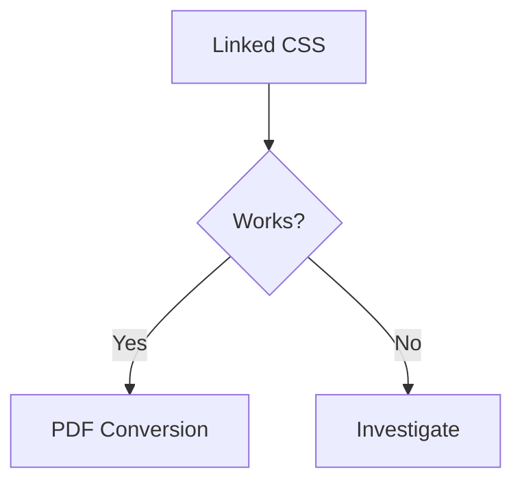

# External CSS Example

This example demonstrates generating HTML that links to an external stylesheet instead of embedding it.

```mermaid
graph TD
  A[Linked CSS] --> B{Works?}
  B -- Yes --> C[PDF Conversion]
  B -- No --> D[Investigate]
```

Some math: $E=mc^2$.

A list:
- Item 1
- Item 2
- Item 3
