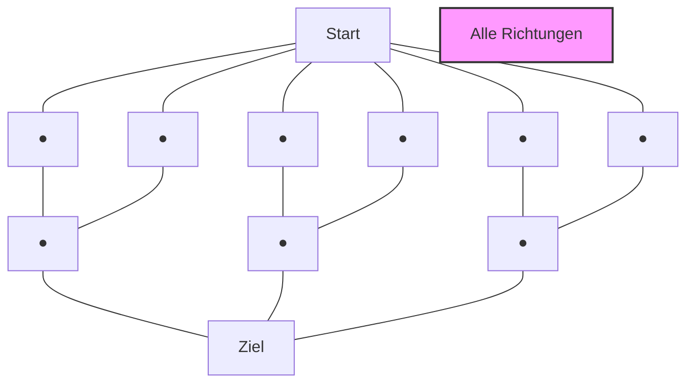
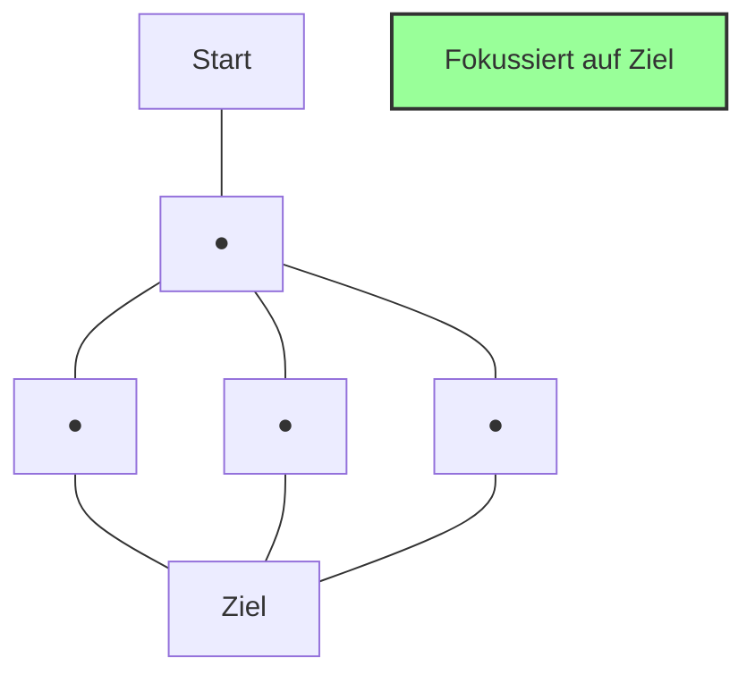
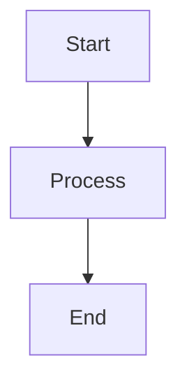

# Mermaid Auto-Layout Test

## Wide Diagram with Many Horizontal Elements

The diagram below has many horizontal elements and will automatically scale to full width:

### Dijkstra expandiert

### A* expandiert

## Narrow Diagram

This simpler diagram will automatically use less width:

## Manual Override

You can still override automatic sizing with width attribute:

